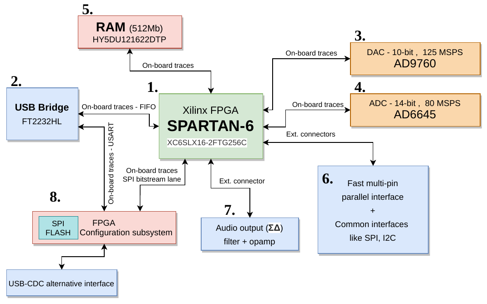

# FPGABasebandBoard

This project is the simplest Baseband Processing board I plan so it has the highest priority.

## Peripherals & interfaces
- ADC - AD6645 (14-bit, 80 MSPS)  
- DAC - AD9740 (10-bit, 125 MSPS)  
- DDR SDRAM - HY5DU121622DTP (512Mb)
- Delta-sigma based audio output interface(with AF filter & opamp buffer)  
- FPGAConfigurationSubsystem - STM32 based circuit for bitstream loading & low speed communication with FPGA
- USB interface - FT2232HL - FIFO to FPGA(for transmitting high-speed data) & UART to FPGAConfigurationSubsystem(for bitstream updates, flow triggering, and low speed data communication with FPGA)
- USB-CDC interface of FPGAConfigurationSubsystem, alternatively can be used for bitstream updates
- A lot other interfaces - there will be header with unused pins - for further use - interfaces like SPI, I2C, something really FASTT, whatever!

## Block diagram

